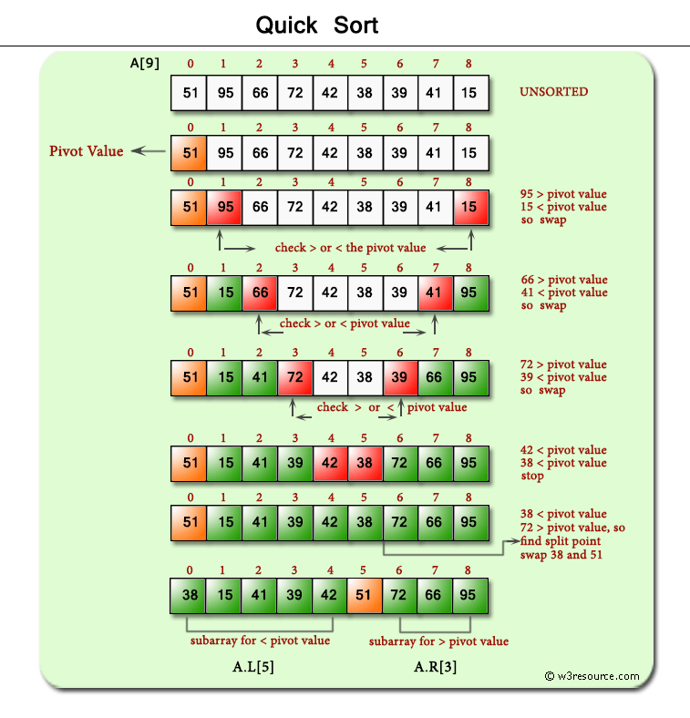

# algorithms-data_structures
#### This repository is dedicated to tracking progress made on my goal of learning new algorithms and data structures useful in the area of Computer Engineering. 
 #### Reference: www.leetcode.com
   

* **Linked Lists**
* **Tree Traversals**
    * Bredth/Depth first
    * Recursive/Iterative
    * Pre-order
    * In-order
    * Post-Order
* **Identify Characteristics Of & Manipulate Trees**
    * Working with BST's to determine characteristics or manipulate in a certain way
* **Graphs**
    * Breadth First Search
    * Depth First Search
    * Tries
* **Stacks/Queues**
* **Hash Tables**

* **Sorting Algoriths** 
    * Insertion 
    * Selection
    * Merge
    * Quick
    * Shortest path
    
* **Sliding Window**
* **Dynamic Programming**

## Useful Links:
* https://www.teamblind.com/post/New-Year-Gift---Curated-List-of-Top-100-LeetCode-Questions-to-Save-Your-Time-OaM1orEU
* https://www.careercup.com/
* https://leetcode.com/discuss/career/216554/from-0-to-clearing-uberappleamazonlinkedingoogle
* https://leetcode.com/discuss/general-discussion/494279/comprehensive-data-structure-and-algorithm-study-guide
* https://www.techiedelight.com/ - explanation of some algorithms with pseudo code
* https://leetcode.com/discuss/general-discussion/458695/dynamic-programming-patterns/439810 - Dynamic Programming Patterns
* https://medium.com/leetcode-patterns/leetcode-pattern-2-sliding-windows-for-strings-e19af105316b - Sliding Window Patterns for Strings

## Sorting Algorithms Reference:
 

